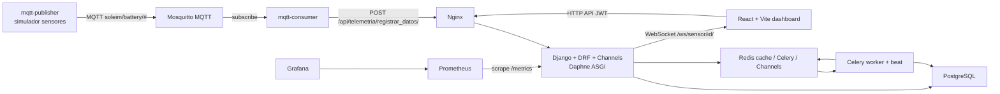

# Documentacion tecnica de Soleim

Este documento describe el estado actual del proyecto `SolarView_FullStack`, con foco principal en el backend, la API y la base de datos. Tambien resume como esta construido el frontend y como se integra con el backend.

Soleim es una plataforma full-stack para monitoreo y operacion de instalaciones solares y smart grids. El sistema recibe datos IoT por MQTT, los procesa en un backend Django, persiste telemetria en PostgreSQL, dispara alertas y ordenes de trabajo, y expone la informacion a un dashboard React.

## 1. Resumen del stack

### Backend

- Lenguaje: Python 3.11.
- Framework principal: Django 5.2.7.
- API REST: Django REST Framework 3.15.2.
- Autenticacion: JWT con `djangorestframework-simplejwt`.
- Tiempo real: Django Channels + Daphne ASGI + Redis Channel Layer.
- Tareas asincronas: Celery 5.4 con Redis como broker/result backend.
- Base de datos: PostgreSQL 16, con pgBouncer como pooler de conexiones en Docker.
- Cache: Redis via `django-redis`.
- Documentacion API: OpenAPI/Swagger/ReDoc con `drf-spectacular`.
- Observabilidad: `django-prometheus`, Prometheus y Grafana.
- Archivos estaticos: WhiteNoise y volumen Docker servido por Nginx.
- Proxy/reverse proxy: Nginx.

### Frontend

- Framework UI: React 19.
- Bundler/dev server: Vite 7.
- Routing: React Router DOM 7.
- Graficas: Recharts.
- Iconos: Lucide React.
- Reportes PDF/tablas: jsPDF y jsPDF AutoTable.
- Fechas: date-fns.
- Estado de autenticacion: React Context + localStorage.

### IoT e infraestructura

- Broker MQTT: Eclipse Mosquitto.
- Simulador IoT: servicio Python `mqtt-publisher`.
- Bridge MQTT -> HTTP: servicio Python `mqtt-consumer`.
- Orquestacion local: Docker Compose.
- CI: GitHub Actions con lint, tests y validacion de migraciones.

## 2. Estructura general del repositorio

```text
SolarView_FullStack/
|-- docker-compose.yml
|-- .env.example
|-- ARQUITECTURA.md
|-- DOCUMENTACION_TECNICA.md
|-- nginx/
|   `-- nginx.conf
|-- prometheus/
|   `-- prometheus.yml
|-- grafana/
|   `-- provisioning/
|-- iot/
|   |-- mosquitto/
|   |-- publisher/
|   `-- consumer/
|-- soleimapp/
|   |-- manage.py
|   |-- requirements.txt
|   |-- Dockerfile
|   |-- soleimapp/
|   |-- core/
|   |-- usuario/
|   |-- telemetria/
|   |-- alerta/
|   |-- analitica/
|   |-- empresa/
|   |-- auditoria/
|   |-- tecnicos/
|   |-- mantenimiento/
|   |-- ordenes/
|   `-- notificaciones/
`-- soleim-front/
    |-- package.json
    |-- vite.config.js
    |-- Dockerfile
    `-- src/
```

El backend vive en `soleimapp/`. El frontend vive en `soleim-front/`. La parte IoT vive en `iot/`. Los servicios de infraestructura estan definidos en `docker-compose.yml`.

## 3. Arquitectura de alto nivel



El flujo principal es:

1. El publicador MQTT simula datos de sensores.
2. Mosquitto recibe mensajes en topicos `soleim/battery/<id>`.
3. El consumer MQTT se suscribe y reenvia cada mensaje al backend por HTTP.
4. Django valida el payload, resuelve si pertenece a un domicilio o instalacion, y persiste `Consumo` y `Bateria`.
5. Celery procesa alertas, notificaciones, ordenes y tareas periodicas.
6. Django Channels envia eventos en tiempo real por WebSocket.
7. React consume la API REST con JWT y presenta paneles, graficas, alertas y reportes.

## 4. Backend Django

El backend esta construido como una aplicacion Django modular. Cada carpeta dentro de `soleimapp/` representa una app de dominio. El proyecto principal esta en `soleimapp/soleimapp/`, donde estan `settings.py`, `urls.py`, `asgi.py`, `wsgi.py`, `celery.py`, paginacion y utilidades de logging.

### 4.1 Proyecto principal `soleimapp`

Responsabilidades:

- Cargar configuracion desde variables de entorno.
- Registrar apps instaladas.
- Configurar DRF, JWT, CORS, Redis, Celery, Channels, logging y OpenAPI.
- Exponer rutas globales.
- Definir healthcheck en `/api/health/`.
- Servir HTTP y WebSocket bajo ASGI.

Archivos clave:

- `soleimapp/settings.py`: configuracion central.
- `soleimapp/urls.py`: inclusion de todas las rutas del backend.
- `soleimapp/asgi.py`: enruta HTTP y WebSocket con `ProtocolTypeRouter`.
- `soleimapp/celery.py`: instancia Celery y autodiscovery de tasks.
- `soleimapp/pagination.py`: paginacion por cursor para tablas de series de tiempo.
- `soleimapp/logging_filters.py`: middleware y filtro de `request_id`.

### 4.2 Apps de dominio

| App | Responsabilidad principal |
| --- | --- |
| `core` | Modelos base: usuarios, geografia, domicilios, empresas, instalaciones, roles por instalacion y configuracion de usuario. |
| `usuario` | Registro, login, logout, refresh JWT y endpoint `/me`. |
| `telemetria` | Ingesta IoT, consumo, bateria, WebSockets, buffer Redis y datos historicos. |
| `alerta` | Tipos de alerta, alertas activas/resueltas y accion de resolver alerta. |
| `analitica` | Agregaciones para dashboard: actividades, bateria, autonomia, tendencias y comparativas. |
| `empresa` | Panel B2B, detalle de instalaciones y reportes CSV. |
| `auditoria` | Registro de eventos relevantes: login, logout, acciones sensibles, etc. |
| `tecnicos` | Perfiles tecnicos, especialidades, zonas de cobertura y disponibilidad. |
| `mantenimiento` | Contratos de servicio, planes y mantenimientos programados. |
| `ordenes` | Ordenes de trabajo, comentarios, evidencias, workflow operativo y SLA. |
| `notificaciones` | Plantillas, notificaciones in-app/email/webhook y envio asincrono. |

## 5. Configuracion del backend

### 5.1 Apps instaladas

El backend usa apps nativas de Django, DRF y librerias operativas:

- `daphne` para ASGI.
- `rest_framework` para API REST.
- `rest_framework_simplejwt.token_blacklist` para invalidar refresh tokens.
- `django_filters` para filtros declarativos.
- `drf_spectacular` para schema OpenAPI.
- `channels` para WebSocket.
- `django_prometheus`, cuando esta instalado, para metricas.
- Apps propias: `core`, `alerta`, `analitica`, `telemetria`, `usuario`, `empresa`, `auditoria`, `tecnicos`, `mantenimiento`, `ordenes`, `notificaciones`.

### 5.2 Base de datos

En Docker se usa PostgreSQL 16. Django se conecta por defecto a `pgbouncer`, no directamente a `postgres`, para mejorar el manejo de conexiones.

Configuracion principal:

```python
DATABASES = {
    "default": {
        "ENGINE": "django_prometheus.db.backends.postgresql",
        "NAME": os.environ.get("POSTGRES_DB", "soleim"),
        "USER": os.environ.get("POSTGRES_USER", "postgres"),
        "PASSWORD": os.environ.get("POSTGRES_PASSWORD", default="1234"),
        "HOST": os.environ.get("POSTGRES_HOST", "localhost"),
        "PORT": os.environ.get("POSTGRES_PORT", "5432"),
        "CONN_MAX_AGE": int(os.environ.get("CONN_MAX_AGE", 60)),
    }
}
```

Notas importantes:

- El engine usa el wrapper de `django_prometheus` para exponer metricas de queries.
- En Docker, `POSTGRES_HOST=pgbouncer` y `POSTGRES_PORT=5432`.
- pgBouncer expone `localhost:6432` para debugging desde host.
- El repositorio tambien contiene un `db.sqlite3`, pero la configuracion real del proyecto apunta a PostgreSQL.

### 5.3 Redis

Redis cumple tres funciones:

- Cache Django via `django-redis`.
- Broker/result backend de Celery.
- Channel Layer de Django Channels.

Variables usadas:

- `REDIS_URL`, por defecto `redis://redis:6379/0`.
- `CELERY_BROKER_URL`, por defecto `redis://redis:6379/1`.
- `CELERY_RESULT_BACKEND`, por defecto `redis://redis:6379/1`.
- Channels usa Redis tambien para grupos WebSocket.

### 5.4 REST Framework

DRF esta configurado con:

- Autenticacion global: `usuario.utils.CoreUsuarioJWTAuthentication`.
- Permisos globales: `IsAuthenticated` y `core.permissions.IsActiveUser`.
- Paginacion por defecto: `PageNumberPagination`, page size 20.
- Filtros: `DjangoFilterBackend`, `SearchFilter`, `OrderingFilter`.
- Schema: `drf_spectacular.openapi.AutoSchema`.
- Throttling:
  - anonimo: `200/day`.
  - usuario: `2000/day`.
  - login: `5/minute`.
  - registro: `10/hour`.

### 5.5 JWT y autenticacion custom

El proyecto no usa `django.contrib.auth.User` como modelo principal de usuario operativo. Usa `core.Usuario`, por eso se implementa `CoreUsuarioJWTAuthentication`.

El login genera manualmente un refresh token con claims:

- `user_id`
- `email`
- `rol`

Configuracion JWT:

- Access token: 1 hora.
- Refresh token: 7 dias.
- Rotacion de refresh tokens: activa.
- Blacklist despues de rotacion: activa.
- Header: `Authorization: Bearer <token>`.

El logout invalida el refresh token recibido en el body:

```json
{
  "refresh": "..."
}
```

### 5.6 Seguridad de cuenta

El modelo `Usuario` incluye:

- `is_active` para desactivar cuentas.
- `failed_login_attempts` para contar intentos fallidos.
- `locked_until` para bloqueo temporal.

Regla implementada:

- 5 intentos fallidos consecutivos bloquean la cuenta por 15 minutos.

La contrasena se guarda hasheada con los hashers de Django. En `Usuario.save()` se detecta si la contrasena no esta hasheada y se aplica `make_password`.

### 5.7 CORS y CSRF

Los origenes CORS salen de `CORS_ALLOWED_ORIGINS`. Por defecto permite:

- `http://localhost:5173`
- `http://localhost:5174`
- `http://127.0.0.1:5173`
- `http://127.0.0.1:5174`
- `http://localhost:3000`

`CORS_ALLOW_CREDENTIALS=True`.

## 6. Modelo de datos

La base de datos esta organizada alrededor de dos contextos: B2C por domicilio y B2B por empresa/instalacion.

### 6.1 Geografia y usuarios

`Pais`

- Tabla: `pais`.
- Campos principales: `idpais`, `nombre`.
- Relacion: tiene muchos `Estado`.

`Estado`

- Tabla: `estado`.
- Campos: `idestado`, `nombre`, `pais`.
- Relacion: pertenece a `Pais`, tiene muchas `Ciudad`.

`Ciudad`

- Tabla: `ciudad`.
- Campos: `idciudad`, `nombre`, `estado`.
- Relacion: pertenece a `Estado`.

`Usuario`

- Tabla: `usuario`.
- Campos: `idusuario`, `nombre`, `email`, `contrasena`, `rol`, `fecha_registro`, `is_active`, `failed_login_attempts`, `locked_until`.
- Roles globales: `admin`, `user`.
- Provee propiedades `is_authenticated` e `is_anonymous` para compatibilidad con DRF.
- Implementa `set_password`, `check_password`, `record_failed_login`, `reset_failed_logins` e `is_locked`.

`Domicilio`

- Tabla: `domicilio`.
- Campos: `iddomicilio`, `ciudad`, `usuario`.
- Representa el caso residencial o legacy B2C.

### 6.2 Multi-tenant B2B

`Empresa`

- Tabla: `empresa`.
- Campos: `idempresa`, `nombre`, `nit`, `sector`, `ciudad`, `fecha_registro`.
- `nit` es unico.
- Es el tenant empresarial principal.

`Instalacion`

- Tabla: `instalacion`.
- Campos principales: `idinstalacion`, `empresa`, `nombre`, `direccion`, `ciudad`, `tipo_sistema`, `capacidad_panel_kw`, `capacidad_bateria_kwh`, `fecha_instalacion`, `estado`.
- Tipos de sistema: `hibrido`, `off_grid`, `grid_tie`.
- Estados: `activa`, `inactiva`, `mantenimiento`.
- Campos operativos: `ultimo_mantenimiento`, `proximo_mantenimiento`, `garantia_hasta`.

`RolInstalacion`

- Tabla: `rol_instalacion`.
- Campos: `usuario`, `instalacion`, `rol`.
- Roles por instalacion: `viewer`, `operador`, `admin_empresa`.
- Tiene restriccion `unique_together = ("usuario", "instalacion")`.
- Permite controlar acceso por instalacion, no solo por rol global.

`ConfiguracionUser`

- Tabla: `configuracion_usuario`.
- Campos: `nombre`, `domicilio`, `instalacion`, `notificaciones_email`, `prioridad`, `alertas_activas`.
- Prioridades energeticas: `electrica`, `solar`, `auto`.
- Une preferencias del usuario con domicilio/instalacion.

### 6.3 Telemetria

`Consumo`

- Tabla: `consumo`.
- Campos: `idconsumo`, `domicilio`, `instalacion`, `energia_consumida`, `potencia`, `fuente`, `costo`, `fecha`.
- Fuentes: `solar`, `electrica`.
- Puede estar asociado a `Domicilio` o a `Instalacion`.
- Orden por defecto: `fecha` descendente.

Indices:

- `(domicilio, fecha)`
- `(domicilio, fuente, fecha)`
- `fecha`
- `(instalacion, fecha)`
- `(instalacion, fuente, fecha)`

`Bateria`

- Tabla: `bateria`.
- Campos: `idbateria`, `domicilio`, `instalacion`, `voltaje`, `corriente`, `temperatura`, `capacidad_bateria`, `porcentaje_carga`, `tiempo_restante`, `fecha_registro`.
- Puede estar asociada a `Domicilio` o `Instalacion`.
- Tiene metodos de dominio:
  - `alerta_temperatura()`: crea alerta si `temperatura > 40`.
  - `alerta_carga()`: crea alerta si `porcentaje_carga < 20`.

Indices:

- `(domicilio, fecha_registro)`
- `-fecha_registro`
- `(instalacion, fecha_registro)`

### 6.4 Alertas

`TipoAlerta`

- Tabla: `tipoalerta`.
- Campos: `idtipoalerta`, `nombre`, `descripcion`.
- Funciona como catalogo.

`Alerta`

- Tabla: `alerta`.
- Campos: `idalerta`, `tipoalerta`, `domicilio`, `instalacion`, `mensaje`, `fecha`, `estado`, `severidad`, `causa_probable`, `accion_sugerida`, `resuelta_por`.
- Estados: `activa`, `resuelta`, `cancelada`.
- Severidades: `critica`, `alta`, `media`, `baja`.
- Orden por defecto: `fecha` descendente.

Las alertas criticas o altas asociadas a una instalacion disparan automaticamente el workflow de ordenes de trabajo mediante signals de la app `ordenes`.

### 6.5 Auditoria

`EventoAuditoria`

- Tabla: `evento_auditoria`.
- Campos: `usuario`, `accion`, `entidad`, `entidad_id`, `detalle`, `timestamp`, `ip_address`.
- `detalle` es JSON.
- Indices:
  - `(entidad, entidad_id)`
  - `(usuario, timestamp)`

Se usa para registrar eventos como registro, login, login fallido y logout.

### 6.6 Tecnicos y mantenimiento

`Especialidad`

- Tabla: `especialidad`.
- Campos: `idespecialidad`, `nombre`, `descripcion`.
- Catalogo de habilidades tecnicas.

`PerfilTecnico`

- Tabla: `perfil_tecnico`.
- Relacion 1:1 con `core.Usuario`.
- Pertenece a una `Empresa`.
- Campos: `cedula`, `telefono`, `especialidades`, `zonas`, `disponible`, `licencia_vence`, `notas`.
- Tiene manager `disponibles_en_zona()` para despacho segun ciudad, especialidad, empresa y carga actual.

`ContratoServicio`

- Tabla: `contrato_servicio`.
- Relacion 1:1 con `Instalacion`.
- Define nivel de servicio, SLA y frecuencia de mantenimiento.
- Niveles: `basico`, `estandar`, `premium`.

`PlanMantenimiento`

- Tabla: `plan_mantenimiento`.
- Define checklist, frecuencia, duracion estimada y especialidad requerida por tipo de sistema.
- `checklist` es JSON.

`Mantenimiento`

- Tabla: `mantenimiento`.
- Representa una instancia programada de mantenimiento para una instalacion.
- Puede enlazarse 1:1 con una `OrdenTrabajo`.

### 6.7 Ordenes y notificaciones

`OrdenTrabajo`

- Tabla: `orden_trabajo`.
- Campos: `codigo`, `instalacion`, `alerta`, `mantenimiento`, `tipo`, `prioridad`, `estado`, `titulo`, `descripcion`, `notas_resolucion`, `asignado_a`, `creado_por`, `sla_objetivo_horas`, timestamps de ciclo de vida.
- Tipos: `correctivo`, `preventivo`, `inspeccion`, `instalacion`.
- Prioridades: `urgente`, `alta`, `media`, `baja`.
- Estados: `abierta`, `asignada`, `en_progreso`, `completada`, `cerrada`, `cancelada`.
- Codigo legible: `OT-YYYY-NNNNN`.
- Tiene helpers `es_sla_vencido()` y `tiempo_resolucion_horas()`.

`ComentarioOrden`

- Tabla: `comentario_orden`.
- Guarda comentarios, cambios de estado y mensajes de sistema asociados a una orden.

`EvidenciaOrden`

- Tabla: `evidencia_orden`.
- Guarda archivos asociados a una orden: foto, firma o documento.
- Usa `FileField` con ruta `ordenes/%Y/%m/`.

`PlantillaNotificacion`

- Tabla: `plantilla_notificacion`.
- Define plantillas reutilizables con `clave`, `asunto`, `cuerpo_txt`, `cuerpo_html` y canales default.

`Notificacion`

- Tabla: `notificacion`.
- Guarda notificaciones individuales por usuario.
- Canales: `in_app`, `email`, `sms`, `push`, `webhook`.
- Estados: `pendiente`, `enviada`, `fallida`, `leida`.
- Incluye `metadata` JSON.

## 7. API REST

La API esta montada principalmente bajo `/api/`. Las rutas se componen en `soleimapp/urls.py`, que incluye los `urls.py` de cada app.

### 7.1 Salud, documentacion y admin

| Metodo | Ruta | Descripcion |
| --- | --- | --- |
| GET | `/api/health/` | Healthcheck de DB, Redis y longitud del buffer IoT. |
| GET | `/api/schema/` | Schema OpenAPI. |
| GET | `/api/docs/` | Swagger UI. |
| GET | `/api/redoc/` | ReDoc. |
| GET | `/admin/` | Django admin. |
| GET | `/metrics` | Metricas Prometheus si `django-prometheus` esta activo. |

### 7.2 Autenticacion

| Metodo | Ruta | Descripcion |
| --- | --- | --- |
| POST | `/api/auth/register/` | Registra usuario y devuelve tokens. |
| POST | `/api/auth/login/` | Login con email/contrasena y devuelve tokens. |
| POST | `/api/auth/logout/` | Invalida refresh token. Requiere JWT. |
| POST | `/api/auth/refresh/` | Refresca access token con SimpleJWT. |
| GET | `/api/auth/me/` | Devuelve usuario autenticado. |

Detalles:

- `register` valida email unico, contrasena minima, validadores de Django, al menos una mayuscula y al menos un numero.
- `login` no revela si el email existe y aplica bloqueo por intentos fallidos.
- `logout` usa blacklist del refresh token.

### 7.3 Core

Prefijo: `/api/core/`

Rutas via DRF router:

- `/api/core/usuarios/`
- `/api/core/domicilios/`
- `/api/core/paises/`
- `/api/core/estados/`
- `/api/core/ciudades/`
- `/api/core/empresas/`
- `/api/core/instalaciones/`

Comportamiento importante:

- Usuarios admin globales pueden ver/gestionar todos los usuarios.
- Usuarios no admin solo ven su propio usuario.
- Domicilios se filtran por el usuario autenticado si no es admin.
- Empresas e instalaciones son read-only en la API actual.
- Instalaciones se filtran por `RolInstalacion` para usuarios no admin.

### 7.4 Telemetria

| Metodo | Ruta | Descripcion |
| --- | --- | --- |
| POST | `/api/telemetria/registrar_datos/` | Endpoint de ingesta IoT. No usa JWT; usa clave compartida `X-IoT-Key` si esta configurada. |
| GET | `/api/telemetria/ver_datos/` | Devuelve ultimos 10 consumos y baterias visibles para el usuario. |
| GET | `/api/factura/mensual/` | Factura mensual por domicilio, mes y ano. |
| GET | `/api/telemetria/consumos/` | ViewSet read-only paginado por cursor. Filtros: `instalacion`, `fuente`. |
| GET | `/api/telemetria/baterias/` | ViewSet read-only paginado por cursor. Filtro: `instalacion`. |

Payload esperado por `registrar_datos`:

```json
{
  "instalacion_id": 1,
  "energia_consumida": 1.25,
  "potencia": 0.7,
  "fuente": "solar",
  "costo": 350.0,
  "voltaje": 3.9,
  "corriente": 1.2,
  "temperatura": 32.5,
  "capacidad_bateria": 2.2,
  "porcentaje_carga": 76.0,
  "tiempo_restante": 6.5
}
```

Tambien puede recibir `domicilio_id` en lugar de `instalacion_id`. Si llega por domicilio, el backend intenta resolver una instalacion asociada usando `ConfiguracionUser`.

Validaciones:

- Requiere `domicilio_id` o `instalacion_id`.
- `energia_consumida`, `potencia`, `costo`, `voltaje`, `corriente`, `capacidad_bateria`, `tiempo_restante` deben ser numeros no negativos.
- `fuente` debe ser `solar` o `electrica`.
- `porcentaje_carga` debe estar entre 0 y 100.
- Si `IOT_SHARED_SECRET` esta definido, la peticion debe incluir `X-IoT-Key`.

### 7.5 Analitica

| Metodo | Ruta | Descripcion |
| --- | --- | --- |
| GET | `/api/analitica/actividades/` | Agregaciones de consumo por periodo. |
| GET | `/api/analitica/bateria/` | Estado actual/promedio de bateria. |
| GET | `/api/analitica/autonomia/` | Autonomia estimada de una instalacion. |
| GET | `/api/analitica/tendencia/` | Tendencia por dias de consumo solar/electrico y bateria. |
| GET | `/api/analitica/comparativa/` | Comparativa de instalaciones de una empresa. |

Estas rutas alimentan las graficas y KPIs del dashboard. Usan filtros por `domicilio_id`, `instalacion_id`, `empresa_id`, `periodo`, fechas o cantidad de dias, dependiendo del endpoint.

### 7.6 Alertas

| Metodo | Ruta | Descripcion |
| --- | --- | --- |
| GET | `/api/alertas/ultimas/` | Ultimas alertas visibles para el usuario. |
| GET/POST | `/api/alertas/alertas/` | ViewSet de alertas. |
| GET/PATCH/DELETE | `/api/alertas/alertas/{id}/` | Detalle de alerta. |
| POST | `/api/alertas/alertas/{id}/resolver/` | Marca alerta como resuelta. |
| GET | `/api/alertas/tipos-alerta/` | Catalogo read-only de tipos de alerta. |

La resolucion de alerta cambia `estado` a `resuelta` y guarda `resuelta_por`.

### 7.7 Empresa

| Metodo | Ruta | Descripcion |
| --- | --- | --- |
| GET | `/api/empresa/panel/` | Panel resumen por empresa e instalaciones visibles. |
| GET | `/api/empresa/instalaciones/` | Lista instalaciones visibles para el usuario. |
| GET | `/api/empresa/instalacion/{id}/` | Detalle operativo de una instalacion. |
| GET | `/api/empresa/reporte/consumo/` | CSV de consumo. |
| GET | `/api/empresa/reporte/alertas/` | CSV de alertas. |

Estos endpoints son los mas importantes para el dashboard B2B del frontend.

### 7.8 Tecnicos, mantenimiento, ordenes y notificaciones

Tecnicos:

- `/api/tecnicos/especialidades/`
- `/api/tecnicos/perfiles/`
- `/api/tecnicos/perfiles/disponibles/`

Mantenimiento:

- `/api/mantenimiento/contratos/`
- `/api/mantenimiento/planes/`
- `/api/mantenimiento/programados/`
- `/api/mantenimiento/programados/{id}/cancelar/`

Ordenes:

- `/api/ordenes/mis-ordenes/`
- `/api/ordenes/ordenes/`
- `/api/ordenes/ordenes/{id}/asignar/`
- `/api/ordenes/ordenes/{id}/iniciar/`
- `/api/ordenes/ordenes/{id}/completar/`
- `/api/ordenes/ordenes/{id}/cerrar/`
- `/api/ordenes/ordenes/{id}/cancelar/`
- `/api/ordenes/ordenes/{id}/comentarios/`
- `/api/ordenes/ordenes/{id}/evidencias/`

Notificaciones:

- `/api/notificaciones/`
- `/api/notificaciones/{id}/marcar-leida/`
- `/api/notificaciones/marcar-todas-leidas/`
- `/api/notificaciones/no-leidas-count/`

## 8. Flujo de ingesta IoT

La ingesta IoT es una de las partes mas importantes del backend.

### 8.1 Publicador MQTT

Archivo: `iot/publisher/app.py`.

Responsabilidad:

- Genera datos simulados cada 10 segundos.
- Publica en `soleim/battery/<context_key>`.
- Usa `INSTALACION_ID` o `DOMICILIO_ID`.
- Incluye variables como energia consumida, potencia, fuente, costo, voltaje, corriente, temperatura, capacidad, porcentaje de carga y tiempo restante.

### 8.2 Broker Mosquitto

Archivo: `iot/mosquitto/config/mosquitto.conf`.

Configuracion:

- Puerto MQTT: 1883.
- Puerto WebSocket MQTT: 9001.
- Persistencia activa.
- Acceso anonimo deshabilitado.
- Password file: `/mosquitto/config/mosquitto_passwd`.

### 8.3 Consumer MQTT

Archivo: `iot/consumer/consumer.py`.

Responsabilidad:

- Se conecta a Mosquitto.
- Se suscribe a `soleim/battery/#` con QoS 1.
- Decodifica JSON.
- Reenvia el payload por HTTP a:

```text
POST /api/telemetria/registrar_datos/
```

Si existe `IOT_SHARED_SECRET`, envia:

```http
X-IoT-Key: <secret>
```

En Docker, el consumer apunta a `DJANGO_API=http://nginx`, de modo que el trafico pasa por Nginx y sus limites.

### 8.4 Endpoint `registrar_datos`

Archivo: `telemetria/views.py`.

El endpoint:

1. Valida clave IoT compartida.
2. Parsea JSON.
3. Resuelve `Domicilio` o `Instalacion`.
4. Valida tipos y rangos.
5. Decide si usa escritura directa o buffer Redis.
6. Persiste `Consumo` y `Bateria` o encola en Redis.
7. Dispara Celery para alertas y WebSocket.

### 8.5 Modo sincronico

Si `IOT_BUFFER_ENABLED=False`, el endpoint crea directamente:

- Un registro `Consumo`.
- Un registro `Bateria`.

Luego dispara:

- `process_battery_alerts.delay(bateria.idbateria)`.
- `notify_realtime_update.delay(...)`.

### 8.6 Modo buffer Redis

Si `IOT_BUFFER_ENABLED=True`, el endpoint:

- Valida el payload.
- Serializa los datos.
- Hace `RPUSH` en Redis sobre:
  - `iot:consumo_buffer`
  - `iot:bateria_buffer`
- Devuelve HTTP 202.
- Envia update WebSocket liviano de inmediato.

La escritura real a PostgreSQL la hace `flush_iot_buffer`, una tarea Celery Beat cada 3 segundos.

Ventajas:

- Reduce latencia de ingesta.
- Agrupa escrituras con `bulk_create`.
- Protege a PostgreSQL cuando llegan datos en alta frecuencia.

## 9. Tiempo real con WebSocket

El backend usa Django Channels.

Ruta WebSocket:

```text
ws://<host>/ws/sensor/<target_id>/
```

Archivo: `telemetria/consumers.py`.

Cuando un cliente se conecta:

- Se une al grupo `domicilio_<target_id>`.
- Se une al grupo `instalacion_<target_id>`.

Cuando Celery llama `notify_realtime_update`, se manda un evento a uno o ambos grupos:

```json
{
  "type": "sensor",
  "data": {
    "instalacion_id": 1,
    "energia_consumida": 1.25,
    "fuente": "solar",
    "porcentaje_carga": 76.0,
    "temperatura": 32.5
  }
}
```

Redis funciona como Channel Layer. Daphne sirve el ASGI app. Nginx tiene una ruta especial `/ws/` con headers `Upgrade` y timeouts largos.

## 10. Tareas asincronas y workflows

### 10.1 Celery

Celery se configura en `soleimapp/celery.py` y toma parametros desde Django settings.

Servicios Docker:

- `celery-worker`: ejecuta tareas asincronas.
- `celery-beat`: ejecuta tareas programadas.

Comando worker:

```text
celery -A soleimapp worker -l info --concurrency=4 -Q celery,notifications
```

Comando beat:

```text
celery -A soleimapp beat -l info --schedule /tmp/celerybeat-schedule
```

### 10.2 Tareas de telemetria

Archivo: `telemetria/task.py`.

`process_battery_alerts(bateria_id)`

- Busca la bateria.
- Ejecuta reglas de temperatura y carga.
- Crea alertas si aplica.
- Reintenta hasta 3 veces si falla.

`notify_realtime_update(...)`

- Obtiene channel layer.
- Envia evento a grupos `domicilio_<id>` y/o `instalacion_<id>`.

`flush_iot_buffer()`

- Lee hasta 500 registros por ciclo desde cada lista Redis.
- Hace `bulk_create` en `Consumo` y `Bateria`.
- Para cada bateria creada dispara `process_battery_alerts`.
- Corre cada 3 segundos por Celery Beat.

### 10.3 Tareas de ordenes

Archivo: `ordenes/tasks.py`.

`crear_orden_para_alerta(alerta_id)`

- Se ejecuta cuando aparece una alerta critica o alta.
- Crea una orden correctiva.
- Define SLA segun contrato si existe, o 24 horas por defecto.
- Dispara autoasignacion.

`auto_asignar_orden(orden_id)`

- Busca tecnico disponible en la empresa y zona de la instalacion.
- Ordena por menor carga activa.
- Asigna la orden si encuentra candidato.
- Notifica al tecnico.
- Si no hay tecnico, notifica a admins de empresa.

`generar_mantenimientos_preventivos()`

- Corre diariamente a las 02:00.
- Revisa instalaciones activas con contrato activo.
- Crea mantenimientos y ordenes preventivas para los proximos 7 dias.

`verificar_sla_ordenes()`

- Corre cada hora.
- Detecta ordenes activas con SLA vencido.
- Escala prioridad a `urgente`.
- Notifica administradores de empresa.

`recordatorio_mantenimientos_diario()`

- Corre diariamente a las 08:00.
- Notifica a tecnicos asignados a mantenimientos del dia.

### 10.4 Signals de ordenes

Archivo: `ordenes/signals.py`.

Signals activos:

- `pre_save` de `OrdenTrabajo`: detecta cambio de estado.
- `post_save` de `OrdenTrabajo`: crea comentario automatico por creacion o cambio de estado.
- `post_save` de `Alerta`: si la alerta es nueva, activa, critica/alta y tiene instalacion, encola `crear_orden_para_alerta`.

Esto convierte alertas operativas en ordenes de trabajo sin intervencion manual.

### 10.5 Notificaciones

Archivos:

- `notificaciones/api.py`
- `notificaciones/tasks.py`
- `notificaciones/backends.py`

La funcion publica `notificar(...)`:

1. Busca una plantilla activa por clave.
2. Renderiza asunto y cuerpo con `context`.
3. Crea `Notificacion` en estado `pendiente`.
4. Dispara `enviar_notificacion.delay(...)`.

Backends soportados:

- `in_app`: no requiere envio externo; queda persistida para consulta.
- `email`: usa `django.core.mail.send_mail`.
- `webhook`: hace POST a una URL configurada en metadata o settings.

## 11. Permisos y aislamiento por tenant

La seguridad de datos se apoya en dos niveles:

1. Rol global en `Usuario.rol`: `admin` o `user`.
2. Rol por instalacion en `RolInstalacion`: `viewer`, `operador`, `admin_empresa`.

Clases principales:

- `IsActiveUser`: exige usuario autenticado, activo y no bloqueado.
- `IsAdminGlobal`: exige `rol="admin"`.
- `IsOperadorOrAdmin`: permite admin global o usuarios con rol operador/admin_empresa en alguna instalacion.
- `InstalacionRolePermission`: valida que el usuario tenga un rol minimo en la instalacion del objeto.

Orden de roles:

```text
viewer < operador < admin_empresa
```

Patron frecuente:

- Si `request.user.rol == "admin"`, se permite ver todo.
- Si no, los querysets se filtran por instalaciones donde el usuario tiene `RolInstalacion`.

Este patron aparece en `core`, `telemetria`, `alerta`, `empresa`, `ordenes`, `mantenimiento` y `tecnicos`.

## 12. Analitica y consultas

La app `analitica` calcula datos agregados para UI y reportes:

- Actividades mensuales/semanales.
- Estado de bateria.
- Autonomia estimada.
- Tendencia por dias.
- Comparativa entre instalaciones de una empresa.

El backend evita exponer toda la telemetria cruda para el dashboard principal. En su lugar, ofrece endpoints agregados que ya vienen preparados para graficas y KPIs.

Para series de tiempo crudas, `ConsumoViewSet` y `BateriaViewSet` usan paginacion por cursor:

- `page_size` default: 50.
- `max_page_size`: 500.
- Orden por timestamp descendente.

Esto es mejor que paginacion por offset para tablas grandes de telemetria, porque evita que PostgreSQL tenga que recorrer muchas filas previas en paginas profundas.

## 13. Reportes

La app `empresa` genera reportes CSV:

- `/api/empresa/reporte/consumo/`
- `/api/empresa/reporte/alertas/`

El frontend permite descargar estos CSV desde la pantalla `Reportes.jsx`.

Los CSV se enfocan en instalaciones y ventanas de tiempo. En la UI se manejan periodos como 7, 30, 90 y 180 dias.

Tambien existe `FacturaMensual.jsx` en frontend que usa:

```text
GET /api/factura/mensual/?domicilio_id=<id>&mes=<mes>&ano=<ano>
```

y genera PDF con jsPDF.

## 14. Nginx

Archivo: `nginx/nginx.conf`.

Nginx funciona como reverse proxy delante de Django.

Responsabilidades:

- Servir `/static/` desde volumen Docker.
- Servir `/media/`.
- Proxy WebSocket en `/ws/`.
- Rate limiting diferenciado:
  - API general: `30r/s`, burst 60.
  - Auth: `5r/m`, burst 10.
  - IoT: `200r/s`, burst 400.
- Headers de seguridad:
  - `X-Frame-Options`
  - `X-Content-Type-Options`
  - `X-XSS-Protection`
  - `Referrer-Policy`
- Restringir `/metrics` a redes internas.

En Docker, el backend `django` no expone el puerto 8000 al host; Nginx publica el puerto 80.

## 15. Observabilidad

### 15.1 Healthcheck

Endpoint:

```text
GET /api/health/
```

Valida:

- Conexion a PostgreSQL.
- Conexion a Redis.
- Longitud total del buffer IoT (`iot:consumo_buffer` + `iot:bateria_buffer`).

Respuesta esperada:

```json
{
  "status": "ok",
  "db": "ok",
  "redis": "ok",
  "iot_buffer_len": 0
}
```

Devuelve 503 si DB o Redis fallan.

### 15.2 Prometheus y Grafana

`prometheus/prometheus.yml` scrapea:

- Django en `django:8000/metrics`.
- Prometheus mismo.
- Jobs opcionales para Celery, Postgres, Redis y Nginx exporters.

Grafana se levanta en el puerto 3000 y provisiona datasources/dashboards desde `grafana/provisioning/`.

### 15.3 Logging

El backend incluye `RequestIdMiddleware`, que:

- Genera un UUID por request.
- Lo guarda en thread-local.
- Lo expone en `request.request_id`.
- Lo devuelve en la cabecera `X-Request-ID`.
- Lo inyecta en logs.

Esto facilita rastrear errores entre Nginx, Django y Celery/logs.

## 16. Docker Compose

Servicios principales:

| Servicio | Rol |
| --- | --- |
| `postgres` | Base de datos PostgreSQL 16. |
| `pgbouncer` | Pool de conexiones hacia PostgreSQL. |
| `redis` | Cache, Celery broker/result y Channels. |
| `django` | Backend ASGI con Daphne. |
| `nginx` | Reverse proxy, rate limiting, static/media y WebSocket. |
| `celery-worker` | Ejecucion de tareas asincronas. |
| `celery-beat` | Scheduler de tareas periodicas. |
| `react` | Frontend Vite en desarrollo. |
| `mosquitto` | Broker MQTT. |
| `mqtt-publisher` | Simulador de sensores. |
| `mqtt-consumer` | Bridge MQTT a API Django. |
| `prometheus` | Recoleccion de metricas. |
| `grafana` | Dashboards de observabilidad. |

Puertos publicados:

- `80`: Nginx.
- `5174`: React/Vite.
- `9090`: Prometheus.
- `3000`: Grafana.
- `5432`: PostgreSQL para desarrollo.
- `6432`: pgBouncer para debugging.
- `6379`: Redis para desarrollo.
- `1883`: MQTT.
- `9001`: MQTT sobre WebSocket.

## 17. Frontend React

El frontend esta en `soleim-front/`.

### 17.1 Tecnologias

Dependencias principales:

- `react` y `react-dom`.
- `react-router-dom`.
- `recharts`.
- `lucide-react`.
- `jspdf`.
- `jspdf-autotable`.
- `date-fns`.

Herramientas:

- Vite como dev server y bundler.
- ESLint para linting.
- Dockerfile multi-stage para build estatico con `serve`.

### 17.2 Configuracion Vite

`vite.config.js`:

- Usa plugin React.
- Dev server en puerto `5174`.
- Proxy de `/api` hacia `http://127.0.0.1:8000`.

El frontend tambien usa `VITE_API_URL`. Si no existe, usa:

```text
http://127.0.0.1:8000/api
```

### 17.3 Enrutamiento

Archivo: `src/App.jsx`.

Rutas publicas:

- `/login`
- `/register`

Rutas privadas bajo `PrivateRoute` y `Layout`:

- `/`
- `/instalacion/:id`
- `/alertas`
- `/reportes`
- `/configuracion`
- `/users`

### 17.4 Autenticacion en frontend

Archivo: `src/context/AuthContext.jsx`.

El frontend mantiene:

- `soleim_token` en localStorage.
- `soleim_user` en localStorage.
- `user`, `token`, `loading`, `error` en React state.

Funciones:

- `login(email, contrasena)`
- `register({ nombre, email, contrasena })`
- `logout()`

Cuando login/register son exitosos, guarda el access token y los datos del usuario.

### 17.5 Cliente API

Archivo: `src/services/api.js`.

Responsabilidades:

- Construir `Authorization: Bearer <token>`.
- Consumir endpoints de empresa, analitica, alertas, core y factura mensual.
- Descargar reportes CSV con enlaces directos.

Funciones importantes:

- `fetchPanelEmpresa`
- `fetchInstalaciones`
- `fetchDetalleInstalacion`
- `fetchActivities`
- `fetchTendencia`
- `fetchComparativa`
- `fetchAutonomia`
- `fetchBatteryStatus`
- `fetchUltimasAlertas`
- `resolverAlerta`
- `getAlertas`
- `descargarReporteConsumo`
- `descargarReporteAlertas`
- `getUsers`
- `createUser`
- `updateUser`
- `deleteUser`
- `getDomicilios`
- `getTiposAlerta`
- `fetchFacturaMensual`

### 17.6 Pantallas principales

`Dashboard.jsx`

- Consume `/api/empresa/panel/`.
- Muestra KPIs de instalaciones, activas, alertas criticas y mantenimiento.
- Lista instalaciones con estado, riesgo, bateria y ultima actividad.
- Refresca automaticamente cada 30 segundos.

`InstalacionDetalle.jsx`

- Consume:
  - `/api/empresa/instalacion/{id}/`
  - `/api/analitica/tendencia/`
  - `/api/alertas/alertas/{id}/resolver/`
- Muestra metricas, tendencia energetica, alertas activas e informacion de instalacion.
- Usa Recharts para la grafica de lineas.

`Reportes.jsx`

- Consume `/api/empresa/instalaciones/`.
- Permite seleccionar instalacion y periodo.
- Descarga CSV de consumo y alertas.

`Alertas.jsx`

- Lista alertas y tipos de alerta.
- Consume helpers de `api.js`.

`Login.jsx` y `Register.jsx`

- Usan `AuthContext`.
- Se conectan a `/api/auth/login/` y `/api/auth/register/`.

`Configuracion.jsx`

- Maneja preferencias locales de umbrales en `localStorage`.

### 17.7 Componentes UI

El frontend separa pantallas y componentes:

- `Layout`, `Sidebar`, `Header`: estructura general.
- `PrivateRoute`: guard de rutas autenticadas.
- `ActivitiesChart`, `MonthlyDonutChart`: graficas.
- `BatteryThermometer`, `BatteryInfoCard`, `TodayConsumptionCard`: widgets de energia/bateria.
- `StatsCards`, `TasksTable`, `Calendar`, `FacturaMensual`, `NivelAvatar`: widgets secundarios.

El estilo esta organizado en archivos CSS dentro de `src/styles/`.

## 18. Integracion frontend-backend

La integracion sigue este patron:

1. Usuario entra por `/login`.
2. React llama `POST /api/auth/login/`.
3. Backend devuelve `access` y `refresh`.
4. React guarda el access token en localStorage.
5. Las llamadas siguientes usan:

```http
Authorization: Bearer <access_token>
```

6. DRF valida el token con `CoreUsuarioJWTAuthentication`.
7. Los querysets se filtran segun rol global o roles por instalacion.
8. React renderiza dashboards, detalles, reportes y alertas.

Para actualizacion visual, el dashboard actual usa polling en algunos puntos, por ejemplo `Dashboard.jsx` refresca el panel cada 30 segundos. El backend ya tiene WebSocket listo en `/ws/sensor/<id>/`, por lo que el frontend puede evolucionar a suscribirse a eventos realtime por instalacion.

## 19. CI y pruebas

La carpeta `.github/workflows/ci.yml` define tres jobs:

1. `lint`: ejecuta Ruff y Black.
2. `test`: levanta PostgreSQL y Redis, migra y corre Pytest con cobertura.
3. `migrations`: aplica migraciones y ejecuta `makemigrations --check --dry-run`.

Configuracion Pytest:

- Archivo: `soleimapp/pytest.ini`.
- Settings: `soleimapp.settings`.
- Cobertura minima: 60%.
- Reusa base de datos.
- Desactiva cacheprovider por problemas de permisos/cache.

Tests visibles:

- `test_health.py`
- `test_iot_buffer.py`
- `test_tenant_isolation.py`
- `test_orden_workflow.py`
- `test_comparativa.py`

## 20. Variables de entorno importantes

Desde `.env.example` y `settings.py`:

```text
SECRET_KEY
DEBUG
ALLOWED_HOSTS
CORS_ALLOWED_ORIGINS
POSTGRES_DB
POSTGRES_USER
POSTGRES_PASSWORD
POSTGRES_HOST
POSTGRES_PORT
REDIS_URL
CELERY_BROKER_URL
CELERY_RESULT_BACKEND
MQTT_USER
MQTT_PASS
IOT_SHARED_SECRET
IOT_BUFFER_ENABLED
DEFAULT_FROM_EMAIL
EMAIL_BACKEND
DEFAULT_WEBHOOK_URL
GRAFANA_PASSWORD
```

Las mas sensibles son:

- `SECRET_KEY`
- `POSTGRES_PASSWORD`
- `MQTT_PASS`
- `IOT_SHARED_SECRET`
- credenciales SMTP/webhook si se agregan.

## 21. Puntos tecnicos importantes del backend

- El backend es API-first: casi toda la funcionalidad se expone por DRF.
- La autenticacion se basa en JWT, pero resuelve contra `core.Usuario`, no contra `auth.User`.
- El aislamiento multi-tenant depende de `RolInstalacion`.
- La telemetria soporta dos modelos de contexto: domicilio legacy y nueva instalacion B2B.
- Las tablas de telemetria tienen indices para consultas por fecha/fuente/instalacion.
- Las series de tiempo nuevas usan paginacion por cursor.
- La ingesta IoT puede ser sincronica o bufferizada por Redis.
- Celery desacopla alertas, WebSocket, ordenes, notificaciones y mantenimiento preventivo.
- Signals conectan alertas criticas/altas con ordenes de trabajo.
- Nginx protege rutas con rate limits diferentes segun el tipo de trafico.
- Prometheus/Grafana ya estan considerados en la arquitectura.

## 22. Posibles mejoras detectadas

Estas observaciones salen del estado actual del codigo:

- Algunas piezas del frontend legacy llaman helpers que no aparecen exportados en `src/services/api.js` (`getPaises`, `getEstados`, `getCiudades`, `createDomicilio`, `deleteDomicilio`, `createAlerta`, `updateAlerta`). Conviene completar esos helpers o retirar pantallas legacy.
- El WebSocket esta implementado en backend, pero el dashboard principal actualmente usa polling cada 30 segundos. Se puede mejorar conectando las vistas de instalacion a `/ws/sensor/<id>/`.
- En produccion conviene asegurar que `/metrics` solo sea accesible desde red interna o VPN.
- Si `IOT_SHARED_SECRET` esta vacio, la ingesta IoT queda abierta para desarrollo. En produccion debe ser obligatorio.
- Hay texto con problemas de codificacion en algunos archivos existentes; conviene normalizar a UTF-8.

## 23. Comandos utiles

Levantar todo el stack:

```bash
docker compose up --build
```

Aplicar migraciones dentro del servicio Django:

```bash
docker compose run --rm django python manage.py migrate
```

Validar configuracion Django:

```bash
docker compose run --rm django python manage.py check
```

Correr tests:

```bash
cd soleimapp
pytest
```

Frontend local:

```bash
cd soleim-front
npm install
npm run dev
```

URLs habituales:

```text
Frontend:      http://localhost:5174
API via Nginx: http://localhost
Django docs:   http://localhost/api/docs/
Django admin:  http://localhost/admin/
Prometheus:    http://localhost:9090
Grafana:       http://localhost:3000
MQTT:          localhost:1883
```

## 24. Conclusion

Soleim esta construido como una plataforma full-stack modular con un backend robusto orientado a telemetria, operaciones B2B, alertas, mantenimiento y trabajo en tiempo real. El nucleo tecnico mas importante esta en Django + DRF + PostgreSQL + Redis + Celery + Channels, con una capa IoT basada en MQTT y un dashboard React/Vite para visualizacion y operacion.

El backend ya tiene varias decisiones de arquitectura avanzadas: separacion por apps de dominio, JWT custom sobre modelo propio, aislamiento por instalacion, buffer de ingesta IoT, procesamiento asincrono, WebSockets, healthchecks, metricas, rate limiting y CI con pruebas.
